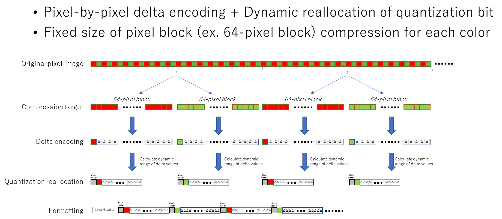
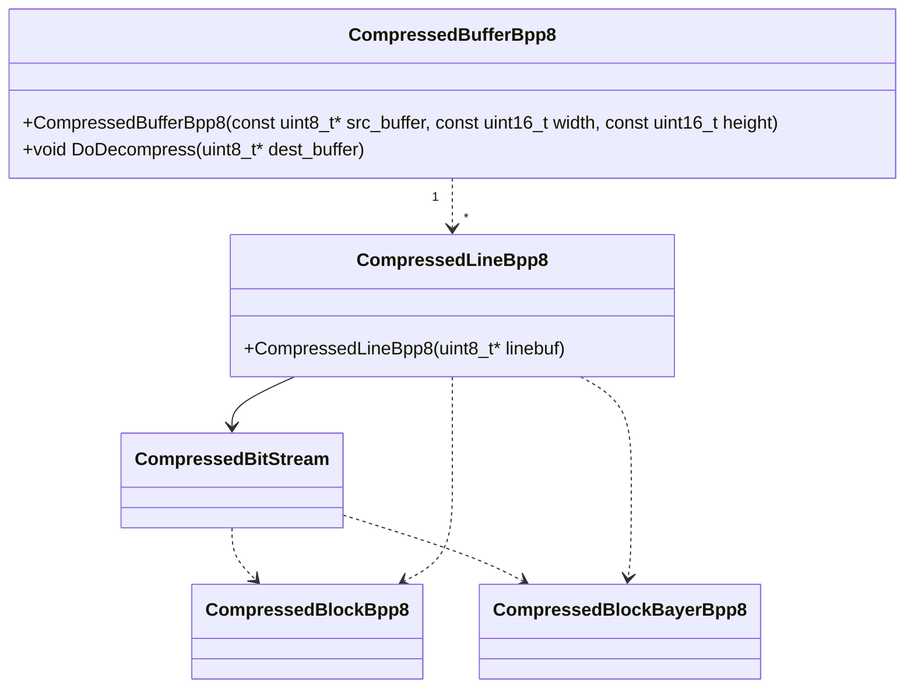

# モジュール構成

## 圧縮仕様

https://jaionline-my.sharepoint.com/:p:/g/personal/kta_jai_com/ERSBnMgd2_pMvAZE3PyqaJMB5P_Y6x-yFkrK4IQsC9mtNA

## クラス図

### CompressedBufferBpp8

### CompressedBufferBpp8()

フレームブッファ上に圧縮された8bit画像データに対して伸長処理を行うクラス。CompressedBufferBpp8コンストラクタにカメラから受信したフレームバッファのポインターをセットし、DoDecompress()メソッドに予め確保した伸長先バッファをセットする事で伸長処理を行う。 

カメラのlosslessモードを予め判定しlossless有効な場合に実行する必要がある。

伸長処理はスレッドによる並列処理を行う。伸長スレッドはスレッドプールを作成する。生成するスレッド数Defaultは`std::thread::hardware_concurrency()`を利用して取得したコア数を利用する。下記GetInstance()の引数としてスレッド数を指定した場合は指定された数のスレッドを生成する。

https://github.com/jai-rd/lossless_compression/blob/f903efad71f7d45f33d5cb0706cc5b719bd37911/src/compressed_buffer_bpp8.cpp#L19

スレッドプールはSingletonとして作成するためフレーム毎に実際に生成処理を行う訳ではない。

#### ~~GetBeforeCompressionHeight()~~

~~圧縮前Heightを計算するメソッドである。圧縮された画像の場合カメラが生成するImageのHeightの値が小さくなってる。eBUS SDKのPvImageクラスで取得できるHeightは圧縮後のHeightである。~~

~~本ライブラリでは伸長結果を展開するバッファを生成するため、圧縮前のHeightが必要である。本メソッドは圧縮データを解析し圧縮前Heightを算出する。~~

~~なお、圧縮データ以上の場合無限ループに陥ることを防ぐため、Height数にLimitを設定してある。もし下記値を超える画像を扱う場合は、適切な値に変更必要である。~~

~~https://github.com/jai-rd/lossless_compression/blob/f903efad71f7d45f33d5cb0706cc5b719bd37911/include/compressed_buffer_bpp8.hpp#L34~~

#### DoDecompress()

伸長処理を実行するメソッドである。本メソッドに伸長結果を展開するバッファをセットし実行する。本メソッドはライン毎にコンストラクタで生成したスレッドを利用して並列処理を行う。

### CompressedLineBpp8

#### CompressedLineBpp8()

コンストラクタにフレームバッファのLine毎のスタート位置を示すポインターをセットして利用する。圧縮データをBitStream処理するためのCompressedBitStreamクラスを生成し、伸長処理はCompressedBitStreamを使って行う。

Line圧縮データは一定幅のBlockで構成されBlock毎に圧縮データのbit数が異なっている。BlockはBlockHeaderを持ちCompressedBlockBpp8, CompressedBlockBayerBpp8クラスでBlockHeaderに従い伸長演算を行う。CompressedBlockBayerBpp8はBayer画像用の伸長クラスだが、カメラから受信した圧縮Bayer画像を伸長した場合`BGBGBG...`のような配置とならない。伸長したデータを`BGBGBG...`のような一般的な配置に置き換える処理が追加されている。

### CompressedBitStream

バッファをBitStreamで扱うためのクラス

現状`CompressedBitStream`はLineに対して一つのクラスを生成する実装になっている。そのため以下のようにDecompress()を1ラインのブロック数分ループする処理になっている。これはBlock境界がByte単位ではなく、Byteに跨る仕様のためこのような設計となっている。

https://github.com/jai-rd/lossless_compression/blob/f903efad71f7d45f33d5cb0706cc5b719bd37911/src/compressed_line_bpp8.cpp#L43-L46

##### CompressedBitStream #ToIntValue()

https://github.com/jai-rd/lossless_compression/blob/f903efad71f7d45f33d5cb0706cc5b719bd37911/src/compressed_bitstream.hpp#L19

`start_bit`から`bit_width`分のbitデータをint16に変換する処理。現状指定されたbitデータが2byteに跨る場合は対応しているが、3byte以上にまたがる処理は未対応である。現在8bitデータ以外は圧縮未サポートであるが、仮に10bit以上のPixelFormatに対しても圧縮対応する場合は3byte跨る場合の対応も必要となる。

### CompressedBufferBpp8d, CompressedLineBpp8d,CompressedBlockBpp8d

カメラ、ツールのDebug用途クラス

[design_debug.md](design_debug.md)

